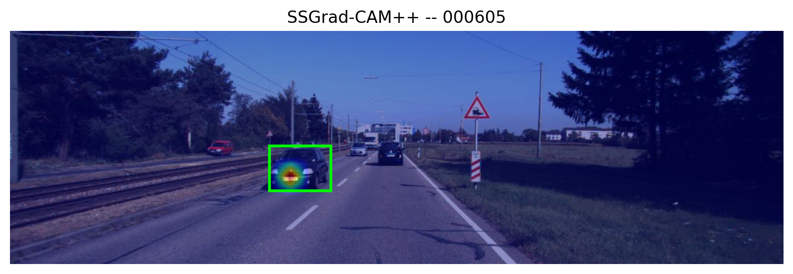
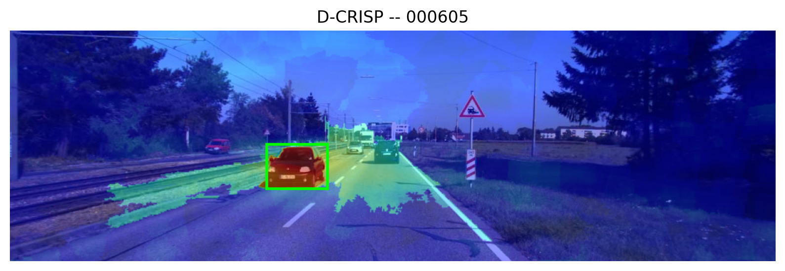

# Benchmark of explainability techniques for neural networks in autonomous driving

Master Thesis Dissertation — Master's Degree in Big Data, Artificial Intelligence and Data Engineering.
**Author:** Alberto Floro Rodríguez · **Advisors:** Javier del Ser Lorente, José Manuel García Nieto

## Description

Comparative benchmark of explainability (XAI) techniques for object-detection neural networks in
autonomous driving: D-CRISP and SSGrad-CAM++, against a random-noise baseline, applied on YOLO26
fine-tuned on KITTI. It includes uncertainty quantification via Test-Time Augmentation (TTA), and
a thorough evaluation of Fidelity (Deletion/Insertion AUC, Minimal Subset), Localization (Pointing
Game, Energy-Based Pointing Game, Relevance Rank Accuracy), Complexity (Sparseness), robustness to
perturbations and stability across samples.

The project is further extended with an industrial warehouse-logistics use case (LOCO dataset): a
robot plans its route by combining an LLM and RRT-Connect, replans in real time upon conflicts
detected by vision, and generates a report explaining each conflict with the same XAI techniques —
see `industrial_use_case/README.md` for the full detail.

## Repository Structure

```
configs/
├── tta_uq.yaml # TTA / uncertainty quantification configuration
└── xai/
├── ssgradcampp.yaml # SSGrad-CAM++ config (generation + evaluation)
├── dcrisp.yaml # D-CRISP config (generation + evaluation)
└── random_baseline.yaml # random-noise baseline config

data/kitti/
├── kitti.yaml # dataset paths and class names
└── kitti_local.example.yaml # template for kitti_local.yaml

models/
├── pretrained/ # COCO-pretrained weights (yolo26n.pt, gitignored)
├── finetuned/ # weights after fine-tuning on KITTI (best.pt)
└── finetuned_loco/ # weights after fine-tuning on LOCO (gitignored, see industrial_use_case/README.md)

notebooks/
├── tests.ipynb # quick exploratory tests, outside the final pipeline
├── tta_augmentation_selection.ipynb # selection protocol for the augmentations used in TTA
├── tta_uncertainty.ipynb # TTA/UQ test on 30 validation images
├── tta_uq_analysis.ipynb # TTA/UQ uncertainty analysis on the 1496 validation images
├── ss_gradcampp_test.ipynb # validation of SSGrad-CAM++ adapted to YOLO26
├── dcrisp_test.ipynb # validation of D-CRISP adapted to YOLO26
├── metrics_test.ipynb # validation of the evaluation metrics
├── xai_evaluation_analysis.ipynb # first analysis of SSGrad-CAM++ cross-referenced with TTA/UQ
└── final_analysis.ipynb # final consolidated analysis: D-CRISP vs SSGrad-CAM++ vs baseline

scripts/
├── train_finetune_stage1.py # YOLO26 fine-tuning on KITTI, stage 1 (frozen backbone)
├── train_finetune_stage2.py # YOLO26 fine-tuning on KITTI, stage 2 (fully unfrozen)
├── train_finetune_stage1_loco.py # same fine-tuning scheme, on LOCO (industrial use case)
├── train_finetune_stage2_loco.py
├── convert_loco_to_yolo.py # converts LOCO's COCO annotations to YOLO format
├── run_tta_uq.py # uncertainty quantification (TTA) on the validation set
├── run_xai_explanations.py # SSGrad-CAM++ heatmap generation on the validation set
├── run_dcrisp_explanations.py # D-CRISP heatmap generation on the validation set
├── run_random_baseline_heatmaps.py # random-noise baseline generation
├── run_evaluation.py # evaluation of the generated heatmaps (faithfulness/localization/complexity/robustness/stability)
└── classify_distance_size.py # classification of objects by size and real distance (stratified analysis)

src/xai_benchmark/
├── data/ # loading and conversion of KITTI labels
├── detection/ # utilities for YOLO26's Detect head
├── uncertainty/ # TTA / uncertainty quantification
├── xai/ # explainability methods (SSGrad-CAM++, D-CRISP)
└── evaluation/ # explanation evaluation metrics

industrial_use_case/ # extension: path planning + XAI for a warehouse-logistics use
# case -- see its own README.md for the full detail

results/ # outputs of all the scripts above (gitignored, fully reproducible)
```


## Results

Visual comparison of the benchmark's two XAI techniques -- D-CRISP and SSGrad-CAM++ -- explaining
the same object: the car closest to the camera (16.39 m) in image `000605` from the KITTI
validation set. In green, the box detected by YOLO26; in red/yellow, higher heatmap relevance for
that prediction.

<p align="center">
  
  <br>
  
</p>

Parameters used, identical to the final runs on the 1496 validation images
(`configs/xai/ssgradcampp.yaml` and `configs/xai/dcrisp.yaml`):

| SSGrad-CAM++ | value |
|---|---|
| checkpoint | `models/finetuned/best.pt` |
| conf_thres / iou_thres_nms | 0.25 / 0.5 |
| iou_match_thres | 0.999 |
| margin (M^{k,det}) | 0 (a single grid cell) |
| eps | 1e-8 |

| D-CRISP | value |
|---|---|
| checkpoint | `models/finetuned/best.pt` |
| conf_thres / iou_thres_nms | 0.25 / 0.5 |
| n_masks (N) | 1000 |
| alpha | 0.50 |
| resolution | 16 |
| p1 | 0.25 |
| num_levels | 5 |


