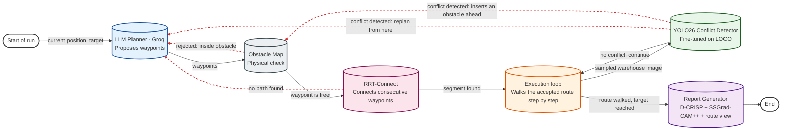

# Industrial Use Case: LLM + RRT-Connect Path Planning with Vision-Based Replanning and XAI Reporting

A robot navigates a synthetic 2D warehouse from a start point to a target. An LLM proposes coarse waypoints, RRT-Connect turns them into a physically valid route, and the robot walks that route step by step. At every step, a YOLO26 detector fine-tuned on the LOCO logistics dataset checks a sampled warehouse image for a nearby obstacle; if one is found, the robot abandons the rest of its route, permanently blocks the space just past it with a small inserted obstacle, and the LLM replans from its current position. Once the run ends, every detected conflict is explained with two explainability methods (D-CRISP and SSGrad-CAM++), and the whole run is rendered into a single HTML report with an interactive 2D route view, a constant-speed animation, and a printable PDF variant.

This module reuses the detection and explainability code already used throughout the rest of the project (`xai_benchmark`): the same dense YOLO head for inference, and the same D-CRISP / SSGrad-CAM++ implementations and fidelity/localization metrics.

## How it works

The system combines four layers in a closed feedback loop:

- **LLM (Groq, `openai/gpt-oss-120b`)** — proposes a short sequence of guidepost waypoints (2 to 5) from the current position to the target.
- **Obstacle map (`ObstacleMap`)** — a hard geometric constraint. Warehouse shelving is modelled as axis-aligned boxes indexed in an R-tree; every LLM-proposed waypoint is checked (`is_point_free`) before RRT-Connect runs. A rejected waypoint gets a locally accurate "nearby free zones" hint (up to 3 rectangles closest to the rejected point), so the LLM can immediately propose a valid alternative instead of repeating the same mistake. It also grows at runtime: every detected conflict permanently adds a small obstacle to this same map (see "Conflict-triggered obstacles" below), so a resolved conflict is never walked into again later in the run.
- **RRT-Connect planner** — grows two trees, one from the current position and one from the target waypoint, and repeatedly tries to connect them directly through free space. It only answers "is there a valid path", with no notion of path cost; every candidate step is filtered through the same obstacle map.
- **YOLO26 conflict detector (fine-tuned on LOCO)** — at every physical step of the accepted route, a real LOCO validation image is sampled and run through the detector. A detection counts as a conflict when it is both close (relative box area at or above the 99th percentile of LOCO's annotated instances) and centered (box center within the middle 30% of the frame on both axes).

If a waypoint is rejected (inside an obstacle), if RRT-Connect cannot connect within its sample budget, or if a conflict is detected during execution, the LLM receives a structured rejection reason and re-plans only the *remaining* route — it never restarts from the beginning.

## Pipeline diagram



*Figure 1: The LLM proposes coarse waypoints, the Obstacle Map performs a hard physical check before RRT-Connect even runs, RRT-Connect plans each segment (filtering every candidate through the same obstacle map), and the execution loop walks the accepted route while a YOLO26 detector checks each step for a conflict. Any rejection — physical, planning, or a detected conflict — feeds a structured reason back to the LLM for re-planning; a detected conflict additionally inserts a small obstacle into the Obstacle Map so the same spot is never walked into again.*

## Path planning

`prompt_builder.build_system_prompt` gives the LLM the room bounds, the exact list of obstacle boxes, and the response contract: a JSON object with 2 to 5 waypoints, the last one equal to the target, no step larger than `STEP_SIZE`.

`llm_rrt_planner.plan_full_route` drives the loop. Each LLM call returns a list of 2 to 5 waypoints; RRT-Connect then consumes them sequentially, in a single pass, without calling the LLM again in between: the first segment connects the robot's *current* position (not one proposed waypoint to another) to the first waypoint, the second segment connects that first waypoint to the second, and so on until the list is exhausted. Only if a waypoint falls inside an obstacle, or RRT-Connect fails to connect within its sample budget, does the loop stop and the LLM get called again — and only for the *remaining* waypoints from the last safely reached position, never restarting the whole route.

| Rejection | Where | Feedback given to the LLM |
| :--- | :--- | :--- |
| Waypoint inside an obstacle | `ObstacleMap.is_point_free` | The offending waypoint, up to 3 nearby free-space rectangles, and the current safe position |
| RRT-Connect fails to connect | `RRTConnectPlanner.plan` (sample budget exhausted) | The unreachable waypoint and a suggestion to route through a wider gap |
| Conflict detected during execution | `conflict_checker.check_conflict` | The detected object's class and the exact position where it was seen, with an explicit instruction not to propose that point again |

In every case, only the *remaining* waypoints are re-generated — the walked prefix of the route is never discarded or re-planned.

## Conflict detection

`conflict_checker.check_conflict` reuses the project's dense (one2many) YOLO head (`xai_benchmark.detection.yolo_head.get_one2many_predictions`) so that a triggering detection's box and per-class probabilities can be handed directly to the explanation methods afterwards, without re-running inference.

A detection triggers a conflict when both conditions hold:

- **Close**: its relative box area (`box_area / image_area`) is at or above `NEAR_RELATIVE_AREA_THRESHOLD` (currently `0.1028`, the 99th percentile of relative box area over LOCO's validation-split annotated instances).
- **Centered**: its box center falls within the middle `CENTER_FRACTION` (currently `0.3`, i.e. 30%) of the frame, on both axes.

When several detections qualify, the largest (closest) one wins. The detector recognizes LOCO's five object classes: small load carrier, forklift, pallet, stillage, and pallet truck.

Conflict images are sampled uniformly at random from the LOCO validation set at every step — they are not rendered from a simulated camera at the robot's actual position. This is a deliberate simplification: it exercises the full detect → explain pipeline on real warehouse imagery without requiring a 3D-rendered scenario.

## Conflict-triggered obstacles

Detecting a conflict does more than trigger a replan: it also permanently blocks the space the robot was walking into, so a later replan can never send it back through the same spot. When a conflict is detected at step position `P`, coming from the previous step position `Q`, a `CONFLICT_OBSTACLE_SIZE` x `CONFLICT_OBSTACLE_SIZE` square (currently 0.5 x 0.5 m) is inserted into the same `ObstacleMap` used by RRT-Connect and the waypoint checks, centered `CONFLICT_OBSTACLE_DISTANCE` (currently 0.5 m, one RRT step) ahead of `P` along the direction from `Q` to `P` — never centered on `P` itself, since the robot's own current position must stay free for RRT-Connect to plan a way out of it. If `Q` and `P` coincide (a degenerate direction), the obstacle is placed toward the target instead.

The obstacle is inserted directly into the live R-tree (`ObstacleMap.add_box`), so it is immediately enforced by both RRT-Connect and the LLM's waypoint checks, and the system prompt is rebuilt with the updated obstacle list before the next replanning call, so the LLM is told about it too rather than discovering it only through a rejection.

Every conflict inserts exactly one obstacle, whether or not it leads to a replan (including the final conflict that exhausts the replan budget), so the saved `conflict_boxes` always line up one-to-one, in order, with `conflict_log`.

## XAI reporting

`report/build_report.py` reads a finished run (`results/industrial_use_case/session.json`) and, for every logged conflict, explains **only the object that triggered it** (both D-CRISP and SSGrad-CAM++ explain a single detection per call) with:

- D-CRISP and SSGrad-CAM++ heatmaps overlaid on the original frame.
- The same seven fidelity/localization metrics used throughout the project: Pointing Game, Energy-Based Pointing Game, Relevance Rank Accuracy, Sparseness, Deletion AUC, Insertion AUC, and Minimal Subset.

D-CRISP is instantiated fresh for every conflict image rather than reused across the run, because it internally caches the first image's letterboxed shape and asserts every later call matches it — an assumption that holds for KITTI's uniform resolution but not for LOCO's variable aspect ratios.

`report/route_visualizer.py` reconstructs the trajectory actually walked across every replan (concatenating `route_history` up to each logged conflict position) and renders it as a two-tab Plotly figure embedded in the report:

- **Route** — the room, the scenario's original obstacles, every conflict-triggered obstacle (in yellow, to distinguish it from the original shelving), the full walked path colored by step, every conflict position, and every abandoned route tail (dashed), all shown at once.
- **Animation (0.5 m/s)** — the same scene animated frame by frame at a constant robot speed, with Play/Pause controls and a scrub slider; abandoned tails, conflict markers, and conflict-triggered obstacles all appear progressively, at the exact frame in which they actually happened.

`report/export_pdf.py` converts the finished `report.html` into `report.pdf` using a headless Chromium browser (Playwright). The PDF keeps the static route view and every conflict's XAI section, but **not the animation** — a static document has no equivalent for Play/Pause/slider controls.

## Project structure

```
industrial_use_case/
├── README.md                    # This file
├── __init__.py
├── planning/
│   ├── __init__.py
│   ├── obstacles_2d.py          # ObstacleMap (R-tree) + local free-space hints
│   ├── rrt_planner.py           # RRT-Connect planner
│   ├── prompt_builder.py        # System prompt sent to the LLM
│   └── llm_rrt_planner.py       # LLM waypoint proposal loop + RRT-Connect glue
├── execution/
│   ├── __init__.py
│   ├── conflict_checker.py      # YOLO26 (LOCO) conflict detector
│   ├── session.py               # In-memory run state (DemoSession)
│   └── run_demo.py              # Entry point: plan, execute, replan, save session.json
└── report/
    ├── __init__.py
    ├── build_report.py          # Per-conflict XAI report -> report.html
    ├── route_visualizer.py      # 2D route + constant-speed animation (Plotly)
    └── export_pdf.py            # report.html -> report.pdf (static route view only)
```

## Setup

### 1. Dependencies

Already listed in the repository's `requirements.txt` (`rtree`, `groq`, `python-dotenv`, `playwright`, on top of the shared `torch`/`ultralytics`/etc. stack):

```bash
pip install -r requirements.txt
playwright install chromium   # one-time, only needed for export_pdf.py
```

### 2. Groq API key

```bash
cp .env.example .env
```

Open `.env` and set:
```
GROQ_API_KEY=your_key_here
```

### 3. LOCO dataset

Download the raw dataset (`loco-all-v1.json` plus the `subset-1` .. `subset-5` image folders) from the official LOCO repository — Mayershofer et al., ICMLA 2020, https://github.com/tum-fml/loco — into `data/LOCO/`. Then convert it to YOLO format:

```bash
python scripts/convert_loco_to_yolo.py
```

This produces `data/LOCO/images/{train,val}`, `data/LOCO/labels/{train,val}` and `data/LOCO/loco_local.yaml`.

### 4. Fine-tuned detector checkpoint

```bash
python scripts/train_finetune_stage1_loco.py
python scripts/train_finetune_stage2_loco.py
```

Then copy the resulting checkpoint to the path every script in this module expects:

```bash
cp results/runs/detect/finetune_stage2_unfrozen_loco/weights/best.pt models/finetuned_loco/best.pt
```

### 5. XAI configuration

`configs/xai/dcrisp.yaml` and `configs/xai/ssgradcampp.yaml` already define the hyperparameters used (mask generation, detection thresholds, evaluation step size). Their `checkpoint` field still points to the KITTI checkpoint used by the rest of the benchmark — `build_report.py` ignores it and always loads `models/finetuned_loco/best.pt` explicitly, since those YAMLs are shared with the KITTI pipeline.

## Running the demo

```bash
python industrial_use_case/execution/run_demo.py
python industrial_use_case/report/build_report.py
python industrial_use_case/report/export_pdf.py   # optional
```

| Command | Produces |
| :--- | :--- |
| `run_demo.py` | `results/industrial_use_case/session.json` — the full run record |
| `build_report.py` | `results/industrial_use_case/report/report.html` (+ `plotly.min.js`, downloaded once next to it) |
| `export_pdf.py` | `results/industrial_use_case/report/report.pdf` |

## Configuration

The demo scenario, planner budgets, and detection thresholds are fixed constants rather than a config file:

| Constant | File | Meaning |
| :--- | :--- | :--- |
| `ROOM_BOUNDS`, `START`, `TARGET`, `OBSTACLES` | `execution/run_demo.py` | The warehouse scenario geometry |
| `STEP_SIZE`, `COLLISION_RESOLUTION`, `MAX_SAMPLES` | `execution/run_demo.py` | RRT-Connect step size, collision-check resolution, sample budget |
| `MAX_LLM_RETRIES`, `MAX_TOTAL_REPLANS`, `SEED` | `execution/run_demo.py` | LLM retry budget per planning call, total replan budget for the run, RNG seed |
| `NEAR_RELATIVE_AREA_THRESHOLD`, `CENTER_FRACTION` | `execution/conflict_checker.py` | Conflict-trigger thresholds (see "Conflict detection" above) |
| `CONFLICT_OBSTACLE_SIZE`, `CONFLICT_OBSTACLE_DISTANCE` | `execution/run_demo.py` | Size and placement distance of the obstacle inserted at each conflict (see "Conflict-triggered obstacles" above) |
| `WAYPOINT_COUNT_RANGE` | `planning/prompt_builder.py` | Min/max waypoints the LLM is asked to propose per call |
| `ROBOT_SPEED` | `report/route_visualizer.py` | Animation speed (m/s) |

## Known limitations

- Conflict images are drawn at random from the LOCO validation set at every step, not from a simulated camera consistent with the robot's actual position in the room (see "Conflict detection" above).
- The scenario (room, obstacles, start/target) is a single fixed layout, not loaded from a config file or varied between runs.
- `report.pdf` has no equivalent of the animation tab — it keeps the static route map and every conflict's XAI section only.
- The conflict-triggered obstacle is always an axis-aligned square: only its *position* accounts for the direction of travel, not its shape.